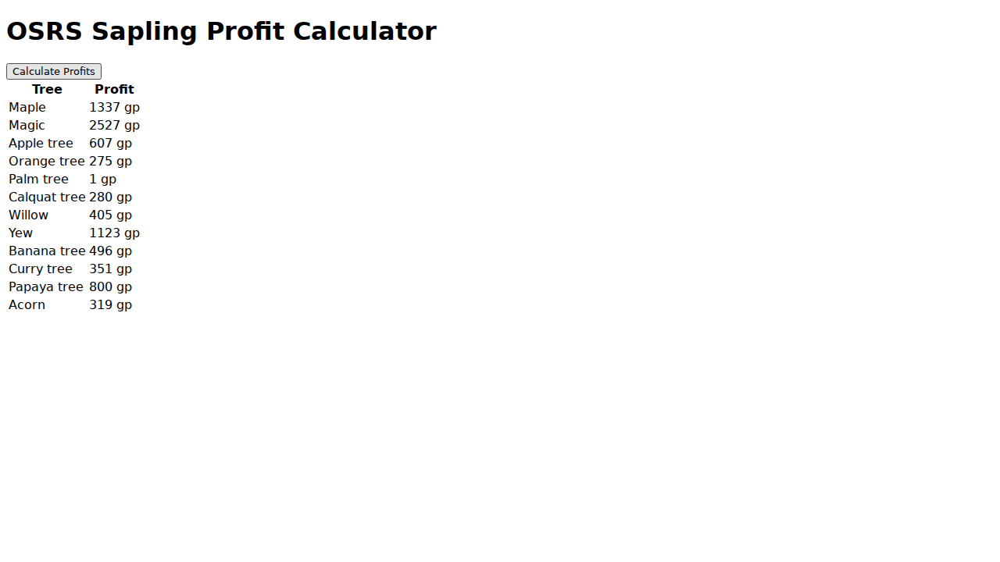

# Saplings Profit Calculator

This service calculates the profit from buying tree seeds and selling the corresponding saplings.

## Running the service

To run the service, execute the following command from the root of the repository:

```bash
go run cmd/saplings/main.go
```

The service will be available at `http://localhost:8080`.

## Screenshot

